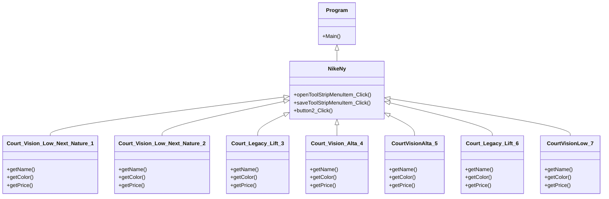

# Final-Project
### ความเป็นมาของโปรแกรม
= เช็คสต็อกสินค้า เพราะว่าการใช้คนเช็คอาจผิดพลาดมากกว่าใช้โปรแกรมในการเช็ค
### จุดประสงค์ของโปรแกรม
= เพื่อบักทึกสินค้าและข้อมูลสินค้า ได้อย่างรวดเร็ว
### โครงสร้างของโปรแกรม (class diagram)

### ผู้พัฒนาโปรแกรม
